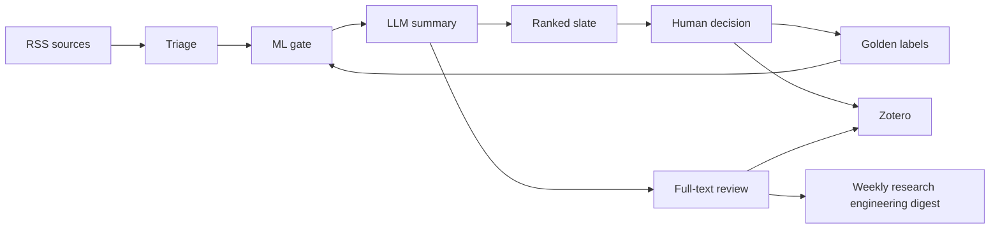
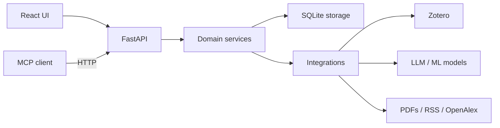
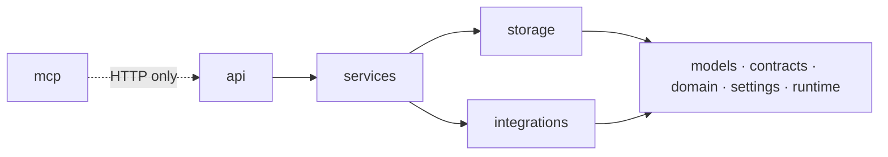

# Architecture

The whole app in one mental model, plus the rules the pre-commit hooks enforce.
Read this before editing; every package also has its own `README.md`.

## Product loop — what does the system do?

Read this first when onboarding or changing triage, ranking, review, or feedback
semantics. It is for users, researchers, product owners, and new contributors.



1. **triage** fetches RSS itself into an app-owned pool and scores it (gate
   first, LLM for survivors) into SQLite.
2. **model** is the relevance gate — trained on your labels, it ranks everything.
3. **api** serves the React UI and the JSON API; routes are thin.
4. **you** cull on *Today*, read on *Library*, fine-label on *Annotate*.
5. **golden** is your label dataset; **model** retrains on it — the loop closes.
6. **zotero** writes back three things: the daily best-picks materialized into
   the *Inbox*, approved label tags/notes (queued + reviewed, backup first),
   and an automatic read-state sync that marks Zotero's own feed cards read
   once the app has triaged them.

## Runtime view — which subsystem owns this?

Read this when implementing a feature, adding an integration, or debugging a
cross-boundary workflow. It is the main view for developers and reviewers.



## Code layering — what may import what?

Read this before creating or moving modules, or while reviewing architecture
changes. It mirrors the rules enforced by `check_import_policy.py`.



Start with the product loop, then drill into the runtime and layering views only
as needed. Add a focused data-ownership, sequence, deployment, or component view
only when multiple writers, non-obvious orchestration, multiple processes, or an
oversized domain makes that deeper view necessary.

## Why it's built this way (decisions + evidence)

The loop above is the *what*; the *why* — every technical choice with its measured number and the
rejected alternatives (with the numbers that killed them) — lives in three companion docs kept
locally under `docs/internal/` (untracked rationale notes, not part of the shared repo):

```
 docs/internal/decisions.md          ADRs: decision → evidence → reproduce command → rejected alt
 docs/internal/validated_defaults.md Tier-0 provenance ledger for each shipped knob default
 docs/internal/knowledge_map.md      parameters × models × status (M measured / P provisional / G guess)
```

Status legend (used across all three): **✅ MEASURED** (real data + reproduce), **⚠️ PROVISIONAL**
(operational baseline; harness built, head-to-head deferred — the open measurement is in
`decisions.md` §GAP), **❓ GUESS** (labelled in code), **❌ REJECTED** (measured-worse; do not
re-propose without new evidence). **Before re-proposing a ❌ or flipping a ⚠️ default, rerun the
cited eval on the same real data and beat the recorded number.** No new evidence → no re-litigation.

## Triage trigger: daemon vs UI

Triage (the pipeline above) runs identically whether it is triggered by:

- the **UI** — the *Today* tab's "Triage backlog" button (`POST /api/daily/triage-backlog`),
  on demand; or
- the **daemon** — `zotero-summarizer feeds serve`, a separate long-running process
  that ticks on a timer and auto-materializes a daily pick; or
- the **CLI** — `feeds run` / `feeds tick` one-shots.

The daemon is optional automation, not a separate engine. The `feeds.*` block in
`goals.yaml` only applies when the daemon runs.

## Where things live

| You want to… | Go to |
|---|---|
| add/change an HTTP endpoint | `api/routes/` (logic → `services/`) |
| change scoring / the ML gate | `services/model/` |
| change labels / training data | `services/golden/` |
| change the feed daemon / Today slate | `services/triage/` |
| change reading / review surfaces | `services/library/` |
| change the weekly project-specific research digest | `services/research_feed/` |
| change what gets written to Zotero | `services/zotero/` |
| touch the DB / SQL | `storage/` |
| talk to Zotero / PDFs / LLM / OpenAlex | `integrations/` |
| change the agent (MCP) surface | `mcp/` (HTTP client only) |
| wire process-wide singletons at startup | `services/lifecycle.py` → `runtime.RuntimeState` |

The live JSON API is self-documenting: run `serve` and open `/docs` (OpenAPI).

## Layering rules (lower never imports higher)

- `integrations/`, `storage/` never import `services/` or `api/`.
- `mcp/` never imports `services/`, `api/`, or `storage/`.
- `services/` may import `api.errors` only (never `api.app` / `api.routes`).

## Data & config

- All app state lives under `data/` (gitignored): the two SQLite DBs
  (`triage_history.db`, `corpus_cache.db`), your golden dataset, logs, the
  append-only **agentic interaction log** (`interaction-events.jsonl` — the
  immutable human-decision + model-prediction trajectory for offline improvement;
  see `services/interaction_log.py`), and ML artifacts. Every path comes from
  `Settings` — never hardcode `project_root / "..."`.
- Config: `.env` (secrets/paths) + `goals.yaml` (**intent only** — research goals,
  triage criteria, rubric, language + the LLM connection; the `USER_OWNED_KEYS`
  allowlist in `models/config.py`). Technical knobs (corpus, prestige,
  quality_review, classifier_gate, prompts) are validated code defaults, overridable
  via `ZS_*` env (`services/config_overrides.py`, `docs/overrides.md`) and refined
  per-user by calibration (planned). Both files are gitignored; copy the `*.example`
  templates to bootstrap. See the README.
- Schema changes are version-gated migrations (`storage/migrations.py`): add a new
  numbered `Migration` step, never an inline `ALTER`.

## Guardrails (enforced by `pre-commit` and CI)

Install once: `pre-commit install`. CI runs the same checks plus the test suites.

1. **≤500 LOC per `.py`, no exceptions** (`tools/precommit/check_file_loc.py`).
   There is no grandfather list; split by responsibility.
2. **Layering / structure policy** (`check_import_policy.py`) — the rules above; new
   service modules must live in a domain subpackage, not at `services/` top level.
3. **Module READMEs** (`check_module_readme.py`) — every package has one, and editing
   a package's code requires staging its `README.md` in the same commit.
4. **Redundancy** (`check_redundancy.py`) — new *provably* redundant transforms
   (idempotent `f(f(x))`, faithful round-trips, identity comprehensions, involutions)
   BLOCK; conditionally-redundant transforms and near-duplicate functions are advisory.
   Existing findings frozen in `redundancy_allowlist.txt`.
5. **AI-slop** (`check_slop.py`) — adopts [aislop](https://github.com/scanaislop/aislop)'s
   deterministic slop/dead-code detectors (swallowed exceptions, debug leftovers, mutable
   defaults, untracked TODOs, narrative/trivial comments, generic names, Long-Method
   complexity). Debug leftovers BLOCK, as do touched functions above 88 body lines,
   6 required parameters, or 5 control-flow levels; other heuristics stay advisory.
   Existing findings are frozen in `slop_allowlist.txt`.

**Seeing findings (advisory, not enforced):** two commands, differing only in scope —
`make scan` (every detector across the whole tree) and `make scan-diff` (the same, scoped to
the `.py` changed vs the base branch). Both always exit 0 and never block; `EMBED=1` adds the
semantic code-model overlap pass, `BASE=<branch>` retargets the diff. The all-pairs **function-
overlap audit** (`tools/precommit/check_overlaps.py`) runs inside them — every function against
every function, ranked by a hybrid of a local code-embedding cosine + graded structural
similarity + API-Jaccard — surfacing consolidation candidates whose intent overlaps even across
different shapes; it degrades to deterministic-only when no embedding model is available.

## Verify a change

Backend tests isolate runtime state and the default project root per test, hide
inherited provider credentials/keyring entries, and block TCP connections. Mock
integrations explicitly; a unit test must never use a live model or Zotero service.

```bash
zotero-summarizer smoke-test                       # app constructs
pre-commit run --all-files                         # guardrails
KMP_DUPLICATE_LIB_OK=TRUE pytest -q --forked       # backend suite *
cd frontend && npm run lint && npm test && npm run build
```

\* On macOS this repo hits a known LightGBM/torch native fork crash; `--forked`
isolates it so one segfaulting test can't sink the run. A handful of those tests
fail for environment reasons, not code — diff against a clean baseline rather than
expecting zero failures.
