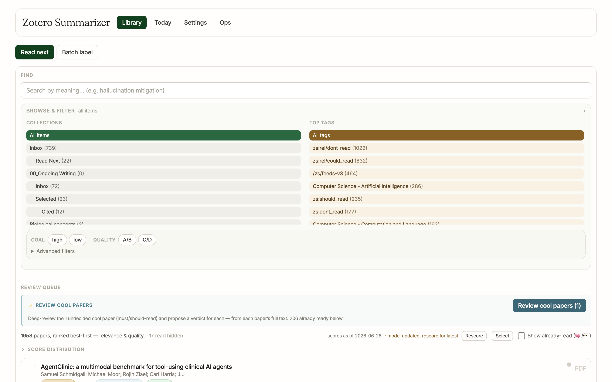
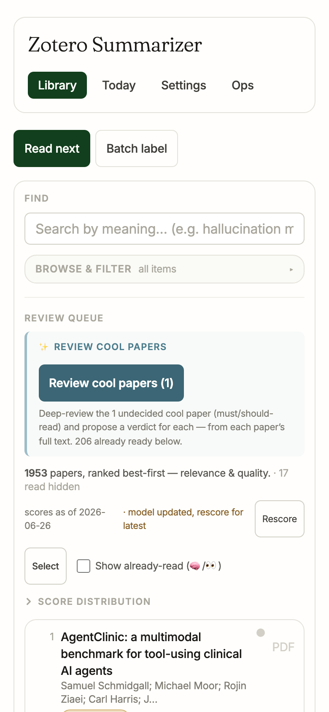
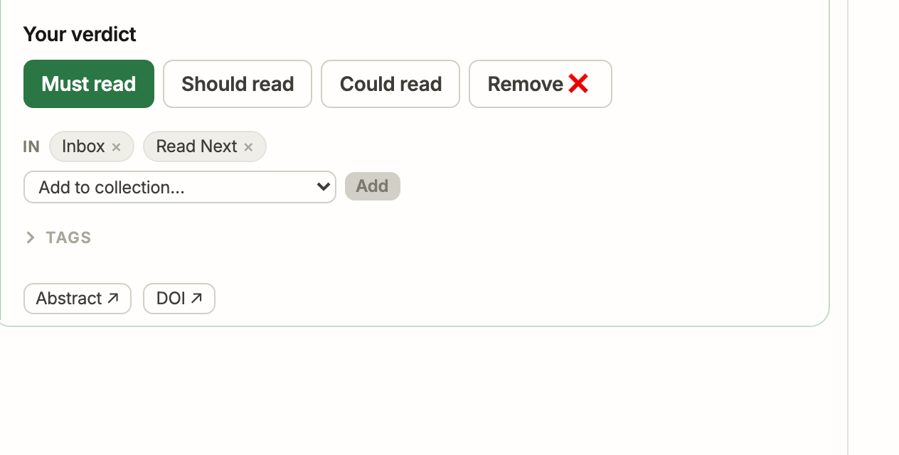
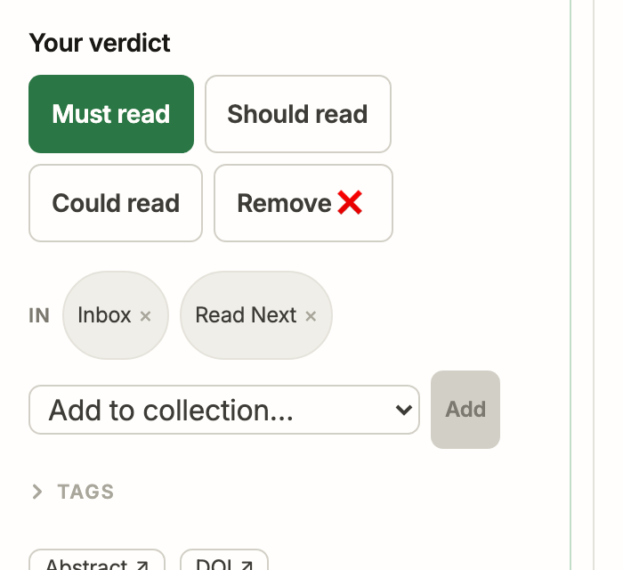
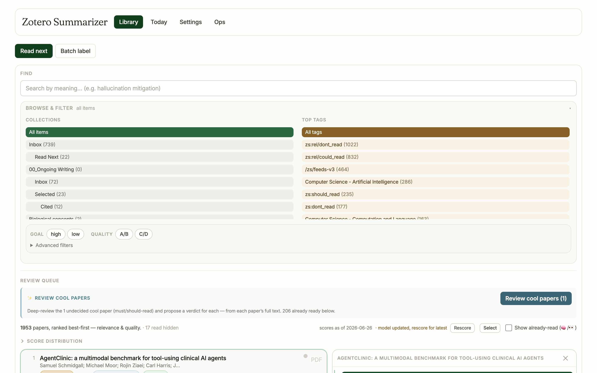
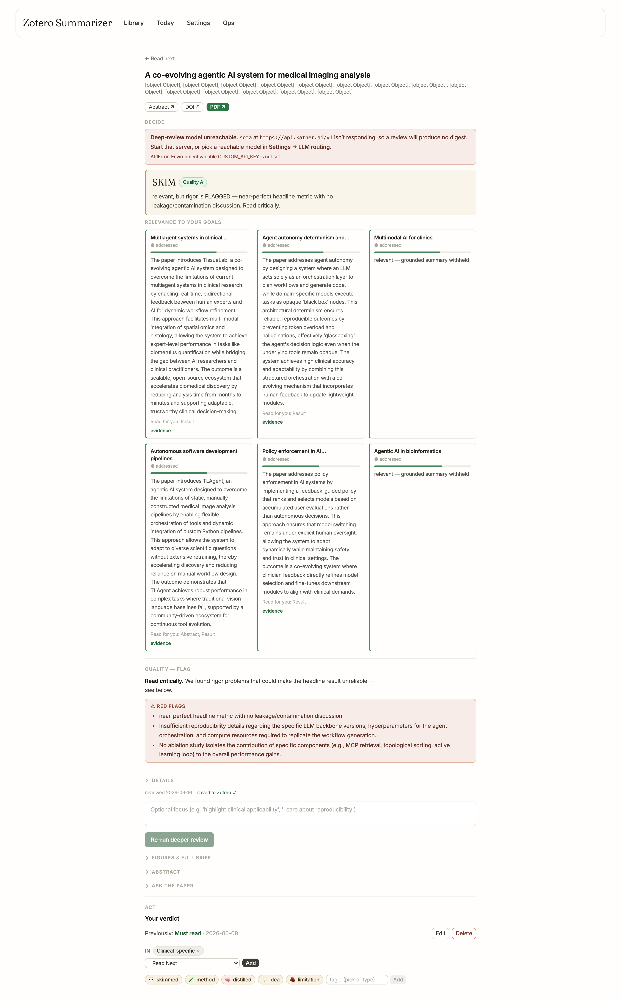
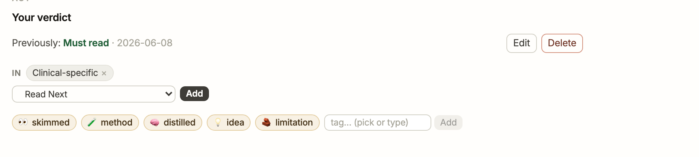
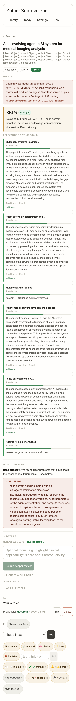

# Usability review — paper-triage workflows (2026-06-26)

Per-screenshot improvement notes for the three core workflows of the triage app.
**Goal: make the daily read → decide → file loop faster and less noisy.** Every
finding is grounded in the user's own [Laws of UX vault] and the [Dataviz
manifesto], names the law it leans on, and gives a concrete, minimal fix
(subtract before add). Findings cite `file:line` where a fix would land.

[Laws of UX vault]: /Users/vladnikulin/Obsidian/Test_vault/02_Information/development/Laws%20of%20UX/Laws%20of%20UX.md
[Dataviz manifesto]: /Users/vladnikulin/Obsidian/Test_vault/00_Inbox/Dataviz%20in%20KatherLab.md

## How this was produced

- Screenshots are **real** captures of the running app against a throwaway copy
  of the live library (no `.env` → no Zotero writes), desktop **1440px** and
  mobile **390px**, in `screens/`.
- Each surface was critiqued by an independent reviewer grounded in the two
  vaults above. This doc synthesises and de-duplicates them.
- Severity: **P0** = breaks or misleads (correctness/trust) · **P1** = real daily
  friction · **P2** = polish.

## The three workflows

```
A. READ-NEXT page  ──click row──▶  B. DECISION CARD  ──"Open full review ↗"──▶  C. /paper/:key
   (scan ranked queue)               (quick verdict + file)                      (read deeply, then act)
   s1_*                              s2_*                                        s3_*
```

---

## Top backlog (ranked, cross-cutting)

| # | Sev | Win | Workflow | Where |
|---|-----|-----|----------|-------|
| 1 | P0 | **Author byline renders `[object Object]`** — reuse `AuthorByline.jsx` (FIXED, see note) | C | `pages/PaperReviewPage.jsx:39` |
| 2 | P0 | **Machine tags leak into Library "Top Tags"** (`zs:rel/…`, `/zs/feeds-v3`) — filter like the tag editor already does | A | `pages/LibraryReadNext.jsx:175` |
| 3 | P0 | **Cached verdict not marked stale** when the deep-review model is unreachable | C | `components/paper/review/PaperReview.jsx:69` |
| 4 | P1 | **One-tap "+ Read Next"** — the page's own default filing costs a `<select>`+`Add`; collapse to one button | B/C | `components/paper/CollectionEditor.jsx:99` |
| 5 | P1 | **Default-collapse the desktop Browse drawer** (mobile already does) — reclaim the fold for the ranked queue | A | `pages/LibraryReadNext.jsx:79` |
| 6 | P1 | **Give the file action the one accent** — after the verdict the whole Act zone is gray; the file step disappears | B | `components/paper/PaperDetailView/index.jsx:140` |
| 7 | P1 | **Collapse the 6-tile goal board** to "addressed N/6" + top-2 tiles; drop the "grounded" accent on withheld tiles | C | `components/paper/review/PaperReview.jsx:93` |
| 8 | P1 | **One rose, not two** — demote the model-unreachable banner to amber so rose stays for paper red-flags | C | `components/paper/DeepReviewSection.jsx:~90` |
| 9 | P1 | **Declutter the REVIEW QUEUE row** — move "Show already-read" into the filter bar; trim the daily prose to one line | A | `components/library/ReadNextView.jsx:244` |

Notes 4–6 are the same theme: **the file step is the slowest, quietest control on
the two surfaces where filing is the point.** Fixing it once in `CollectionEditor`
+ the Act-zone tier carries to both the card and the full page.

> **Already actioned this session:** #1 (author `[object Object]` → now reuses
> `AuthorByline`, rebuilt + lint-clean — the `s3_*` screenshots predate the fix).
> The rest are an open backlog for you to prioritise.

## Minimalism pass — shipped & gated (2026-06-26)

A pure-subtraction visual-minimalism pass landed; after-state screenshots are in
`screens/after-minimalism/`. Verified live (sandbox, real read-only library) +
all static gates (build · eslint · every pre-commit hook).

| Backlog | Change | Before → after (receipt) |
|---|---|---|
| #1 | Author byline → reuse `AuthorByline` | `[object Object]` → real names (`object_object_bug:false`) |
| #2 | Filter machine tags from "Top Tags" + tag editor (shared `utils/tags.js`) | `zs:rel/…`,`/zs/feeds-v3` shown → **0** machine tags (datalist 280→189) |
| #5 | Browse drawer default-collapsed (desktop too) | **1** paper above the fold → **5** |
| #7 | Goal board → only *addressed* tiles + "N not addressed ▾" fold; count in the header | 6 dense tiles → **2 shown / 4 folded** ("Relevance — 2 of 6 goals addressed") |

**Laws-of-UX gate — passed (subtraction-only):** Serial Position (ranked queue
owns the fold), one-code-one-meaning (machine tags gone), Miller / dataviz
"subtract 20%" (goal board), correctness (author). Net: 4 subtractions, the only
added code is a shared util + one fold disclosure.

**Screenshot rubric — all green:** no horizontal overflow at 1440px or 390px
(`scrollW==width`), Read Next still the collection default, rows unchanged/not
widened, tag autocomplete shows only real content tags.

Still open from the backlog (not in this pass): #3 stale-verdict stamp, #4/#6
one-tap "+ Read Next" + file-action accent, #8 one-rose, #9 review-queue
declutter, and the P2 polish items.

---

## A · Read-next page — the daily scan

### A1 · Desktop — `screens/s1_library_desktop.png`


The funnel from ~15 noisy feeds to a few papers worth reading. Today the ranked
queue (the task) sits **below** FIND + an open Browse drawer + a verbose Review-Queue
block + a Score-Distribution heading.

| Sev | Observation | Law / rule | Fix (subtract-first) | Where |
|-----|-------------|-----------|----------------------|-------|
| P0 | "Top Tags" lists app-internal tags: `zs:rel/dont_read (1022)`, `/zs/feeds-v3 (464)`, `zs:should_read` — the biggest "tag" is one no human browses by | Dataviz one-code-one-meaning · Jakob (a tag list = *my* tags) · Cognitive Load | Filter `tData.items` with `!/^\/?zs[:/]/` before `setTags` (same predicate the tag editor now uses) | `LibraryReadNext.jsx:175`, render `:582` |
| P1 | Browse & filter drawer is **open by default on desktop**, pushing the ranked queue off the fold | Serial Position (paper #1 belongs at top) · "subtract 20%" | Default the drawer **collapsed** on desktop (mobile already does); the summary still shows active scope, so nothing hides | `LibraryReadNext.jsx:79-85` |
| P1 | REVIEW QUEUE row mixes 4 jobs on one line: status (count, scores-date) + recompute (Rescore) + mode (Select) + view toggle (Show already-read) | Hick's · Proximity/Common Region | Move "Show already-read" into the filter bar (it's a filter); keep only Rescore + Select on the queue header | `ReadNextView.jsx:244-248` → `LibraryFilterBar.jsx` |
| P1 | Four peer-weight uppercase headers (FIND / BROWSE / REVIEW QUEUE / SCORE DISTRIBUTION) before any content; none reads as primary | Von Restorff ("when all is emphasised, nothing is") · Miller | Score-dist is already a closed disclosure — give the Review-Queue prose the same treatment; leave exactly one emphasised thing above the rows | `ReadNextView.jsx:251-263` (pattern to copy) |
| P2 | Row carries up to 5 glyph systems (🏷 / ◇ / ★ / ◆ / A–D). Each is one-meaning & lean — but it's at the ~5-code ceiling | Miller (≈5 simultaneous codes max) | No change; **watched**. If a 6th chip is proposed, demote ◆ prestige into the expanded panel instead of widening the row | `ReadNextView.jsx:354-429` |
| P2 | `Rescore` button and the amber "model updated, rescore for latest" cue are separate targets | Fitts (cue and action should be one target) | Make the amber text itself the click target | `ReadNextView.jsx:182-195` |

### A2 · Mobile — `screens/s1_library_narrow.png`


| Sev | Observation | Law / rule | Fix | Where |
|-----|-------------|-----------|-----|-------|
| P0 | A **full screen of chrome** precedes paper #1 (nav → toggle → FIND → Browse → 2-line Review-Queue prose → Rescore/Select/Show-read → Score-dist) | Serial Position · Goal-Gradient · dataviz "survive shrink" | Collapse Review-Queue to one line + button; push Rescore/Select/Show-read behind the row ⋮ menu on mobile | `ReadNextView.jsx:158-249` |
| P1 | "Review cool papers (1)" is the loudest element on screen — louder than any paper, for a count of **1** | Von Restorff (emphasis on the automation, not the content) | Scale the button's emphasis to the count: outline weight when undecided ≤2, solid only for a real batch | `PredictionsBar.jsx` button |
| P1 | A 5-line instructional paragraph ("Deep-review the 1 undecided cool paper…") shows on every load | Paradox of the Active User · Cognitive Load | Truncate to "1 undecided · 206 ready below"; keep the full text in the button `title` | `PredictionsBar.jsx` stateLine |
| P2 | "Show already-read (🧠/👀)" carries an emoji legend in its label; wraps oddly at 390px | one-code-one-meaning (legend belongs where the glyph is used) | Drop "(🧠/👀)"; the 🧠 on the row already has a `title` | `ReadNextView.jsx:247` |
| P2 | Each row shows a PDF dot **and** a "PDF" word — same fact twice | dataviz "subtract 20%" | Keep the scannable dot; relabel the word to its *action* (it opens the brief) or drop it | `ReadNextView.jsx:441` |

---

## B · Decision card — quick verdict + file

### B1 · Desktop Act zone — `screens/s2_act_desktop.png`


The verdict is genuinely one-tap (good). The friction is everything after it:
filing is a `<select>`+`Add` ritual, and the whole zone below the verdict is one
flat gray with no second tier.

| Sev | Observation | Law / rule | Fix (subtract-first) | Where |
|-----|-------------|-----------|----------------------|-------|
| P0 | Filing into **Read Next** — the page's own default — costs select-open + pick + a separate **Add** tap; it's the slowest control on the card | Fitts · Hick · Pareto (the 80% path) | Add a single primary **"+ Read Next"** button (one tap files); keep the `<select>` as the secondary "other collection…" path | `CollectionEditor.jsx:99-120` |
| P0 | After the green verdict, everything (IN-chips, Add, TAGS, links) is the same low-saturation gray — the file step visually disappears | Von Restorff · dataviz readability-beats-decoration | **Move** the one accent: give the primary file button the card's teal; leave chips/tags gray. Don't add color, relocate it | `PaperDetailView/index.jsx:140-163` |
| P1 | The "Add" button looks **disabled** (muted slate) even when "Read Next" is preselected and valid | Von Restorff · Aesthetic-Usability | Render Add as an enabled solid button when a target is selected | `CollectionEditor.jsx:113-120` |
| P1 | "Remove ❌" shows a red ✕ even when **inactive**, competing with the green active state; the other three verdicts have no glyph | Von Restorff (reserve emphasis) · Similarity | Drop the inline ✕ from the label; let the rose **active fill** carry "remove", consistent with the others | `VerdictPicker.jsx:32-48`, label `VerdictPanel.jsx:24` |
| P2 | `IN Inbox × / Read Next ×` chips sit right above an add-picker that may still offer a collection the paper is already in | Proximity · Postel | Confirm the preselect falls through to blank when the default is already a current membership | `CollectionEditor.jsx:14-19,36-47` |

### B2 · Mobile Act zone — `screens/s2_act_narrow.png`


| Sev | Observation | Law / rule | Fix | Where |
|-----|-------------|-----------|-----|-------|
| P0 | Verdict wraps to a clean 2×2 of big targets (good), but `Add` is again a gray, disabled-looking block — the weakest target on a touch screen | Fitts (touch) · Von Restorff | Same one-tap **"+ Read Next"**, full-width on narrow | `CollectionEditor.jsx:99-120` |
| P1 | `IN …×` current-collection chips render as heavy rounded pills — visually louder than the next action | Von Restorff (status out-shouts the action) | Lighter chip weight (less pad/fill) so the file CTA is the heaviest non-verdict element | `CollectionEditor.jsx:80-97` |
| P2 | "> TAGS" disclosure label is faint and easy to miss | Selective Attention | Keep disclosed (correct per Hick); nudge the summary contrast + chevron | `PaperDetailView/index.jsx:167-170` |

### B3 · Full card desktop/mobile — `screens/s2_card_desktop.png` · `screens/s2_card_narrow.png`


| Sev | Observation | Law / rule | Fix | Where |
|-----|-------------|-----------|-----|-------|
| P1 | On open, the eye must travel past the list/queue chrome to reach the card's Act zone (esp. the long mobile stack) | Serial Position · Flow/Doherty | `scrollIntoView` the expanded Act zone on open; on mobile consider collapsing sibling rows while one is expanded | `InlineAnnotate.jsx:27` |
| P2 | The teal left-rule ties the card to "a" row but the originating row has no matching active accent | Uniform Connectedness | Give the expanded row a matching teal active state | `ReadNextView.jsx` row + `InlineAnnotate.jsx:27` |

---

## C · Full review page `/paper/:key` — read, then decide

### C1 · Desktop full page — `screens/s3_paper_desktop.png`


**Verdict on the read→act order:** the editable controls living at the **bottom**
(after the evidence) is *correct* for a one-paper-per-tab "read then decide" task —
**do not** add a sticky/top action bar (it duplicates the verdict surface, Tesler).
Instead **subtract the low-signal scroll** between read and act.

| Sev | Observation | Law / rule | Fix (subtract-first) | Where |
|-----|-------------|-----------|----------------------|-------|
| P0 | Author line renders `[object Object], [object Object], …` (authors is an array of objects, joined raw) | correctness | **Reuse `components/AuthorByline.jsx`** (already formats author objects) — *fixed, see note below* | `PaperReviewPage.jsx:39-43` |
| P1 | A red "model unreachable" banner sits above a confident cached "SKIM / Quality A" — the reader can't tell the call is stale | Mental Model · Postel (be honest about input state) | Stamp the verdict banner "cached 2026-06-16 · model offline" when showing a cached review with the model down | `PaperReview.jsx:69-85` |
| P1 | Goal board = 6 dense tiles, several repeating "relevant — grounded summary withheld" under a green "grounded" accent + filled bar (the code contradicts the copy) | one-code-one-meaning · "subtract 20%" · Miller | Collapse to "Addressed N/6 goals" + the top-2 scoring tiles inline; suppress the accent/bar on withheld-summary tiles | `PaperReview.jsx:93-97,161-203` |
| P1 | Two full-width **rose** blocks fight: a system "unreachable" error and a paper "⚠ Red flags" finding | Von Restorff (one accent; same color ≠ two meanings) | Demote the app-state notice to amber; keep rose only for paper red-flags | `DeepReviewSection.jsx:~90` vs `PaperReview.jsx:253-260` |
| P2 | "QUALITY — FLAG" eyebrow prints the raw band token (reads truncated) | dataviz survive-distance | Use the human `BAND_LABEL` ("Quality — Flagged") | `PaperReview.jsx:103` |
| P2 | Verdict-banner reason re-states the red-flag sentence printed two sections later | Tesler/subtract | Keep the one-line call in the banner; let the Quality section own the *why* | `PaperReview.jsx:82-84` vs `253-260` |
| P2 | Goal-tile state text ~10.5px on a wide canvas — decision text as a footnote | dataviz readable-without-zoom | Lift tile state + "Read for you" to 12px | `PaperReview.jsx:180,186` |

### C2 · Desktop Act zone — `screens/s3_act_desktop.png`


| Sev | Observation | Law / rule | Fix | Where |
|-----|-------------|-----------|-----|-------|
| P1 | Banner says **SKIM**; Act zone says "Previously: **Must read**" — two verdicts, no reconciliation | Mental Model | Label them: "Suggested: SKIM" vs "Your verdict: Must read" | `PaperDetailView/index.jsx:140-152` |
| P2 | Picker defaults to "Read Next" though the paper is already filed "Clinical-specific" — re-filing a decided paper | Pareto/Postel | When a non-inbox collection already exists, default the dropdown to blank | `PaperDetailView/index.jsx:156-163` |
| P2 | "Edit / Delete" float far right (~1900px from "Your verdict"); destructive Delete as loud as Edit | Fitts · Proximity · Von Restorff | Group Edit/Delete by the verdict; demote Delete to a text link | `VerdictPanel.jsx` |

### C3 · Mobile — `screens/s3_paper_narrow.png` · `screens/s3_act_narrow.png`


| Sev | Observation | Law / rule | Fix | Where |
|-----|-------------|-----------|-----|-------|
| P1 | Goal tiles stack 1-col → the verdict picker is a very long scroll below the fold (this is where read→act friction is real) | Serial Position · Flow | The C1 board-collapse pays off most here — no sticky bar needed | `PaperReview.jsx:163` |
| P2 | Broken author line wraps to ~4 lines of `[object Object]`, wasting the most precious vertical space | correctness | Same author fix (C1 P0) | `PaperReviewPage.jsx:39-43` |
| P2 | Four near-identical gray disclosure rows (DETAILS / FIGURES / ABSTRACT / ASK) blur together | Similarity | Give "Details" (the decision-relevant digest) slightly stronger weight | `PaperReview.jsx` disclosures |
| P2 | 5 tag chips wrap to 2 rows, "limitation" orphaned next to the free-type field — reads as a broken grid | Prägnanz | Put the 5 quick-pick chips in their own wrap row; the "tag… ▾ / Add" composer on its own row | `PaperDetailView/index.jsx:167-173` |

---

## What's already good (do not churn)

- **Read→act order on `/paper`** is the right spine (evidence first, editable verdict last). Resist a sticky/top action bar — it duplicates the verdict surface.
- **One design language, flat hierarchy** — native `PaperReview`, hairline dividers over nested boxes (Common Region / Uniform Connectedness by subtraction).
- **Decision-first disclosure** — TLDR / rubric / digest folded behind one "Details"; the glance surface stays the call + relevance + red-flags.
- **Honest grade provenance** — grounded checklist coverage instead of LLM self-scores.
- **Verdict is one-tap**, 4 options at the Miller/Hick sweet spot, one shared `PRIORITIES` vocabulary everywhere (Jakob), one reject path (Occam).
- **Read Next preselected and *stable*** (deliberately not "last-used" to avoid default hijack).
- **Three labelled page regions** (FIND read / REVIEW work / EXPORT writes) — clean Common Region; Sync-all owns the rescore→tags→ranks sequence (Tesler).
- **Machine tags already filtered** from the per-paper tag editor — the Browse-drawer Top Tags (A1-P0) is the one remaining surface.

## Appendix — rubric & receipts

Per-screen gate rubric (R1–R10) and DOM receipts (contrast, target px, option
counts, no-overflow `scrollW==width`, "Read Next" default, 0 machine tags in the
editor datalist) are in `screens/receipts.json` and `screens/rec3.json`.
