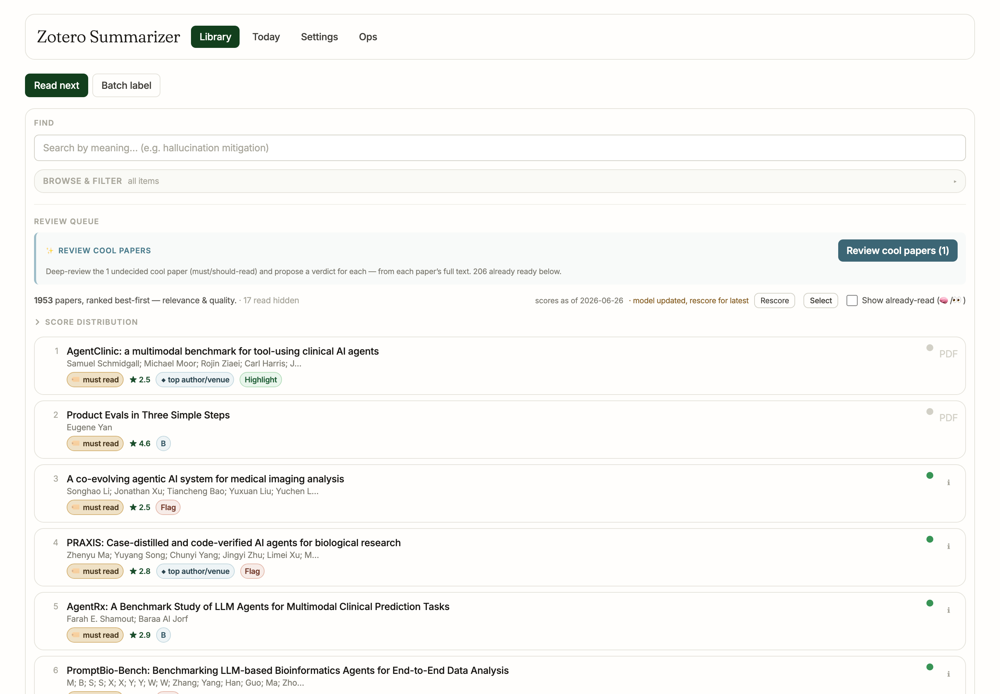
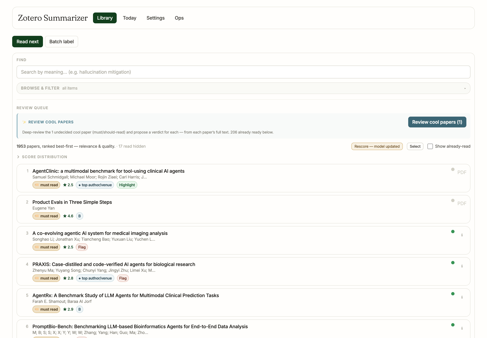
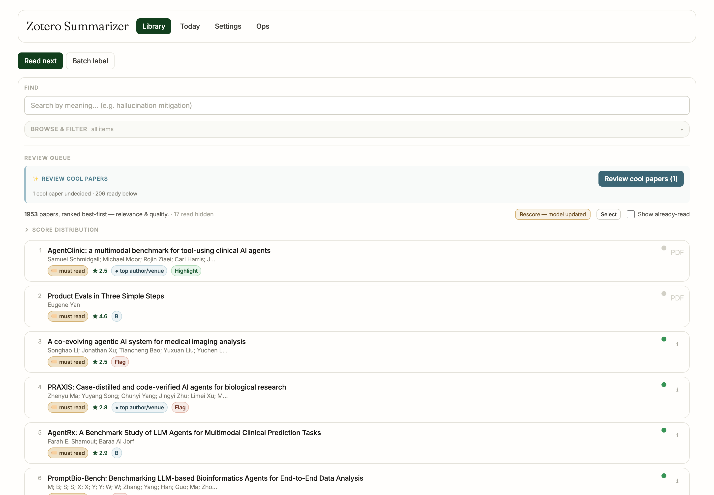
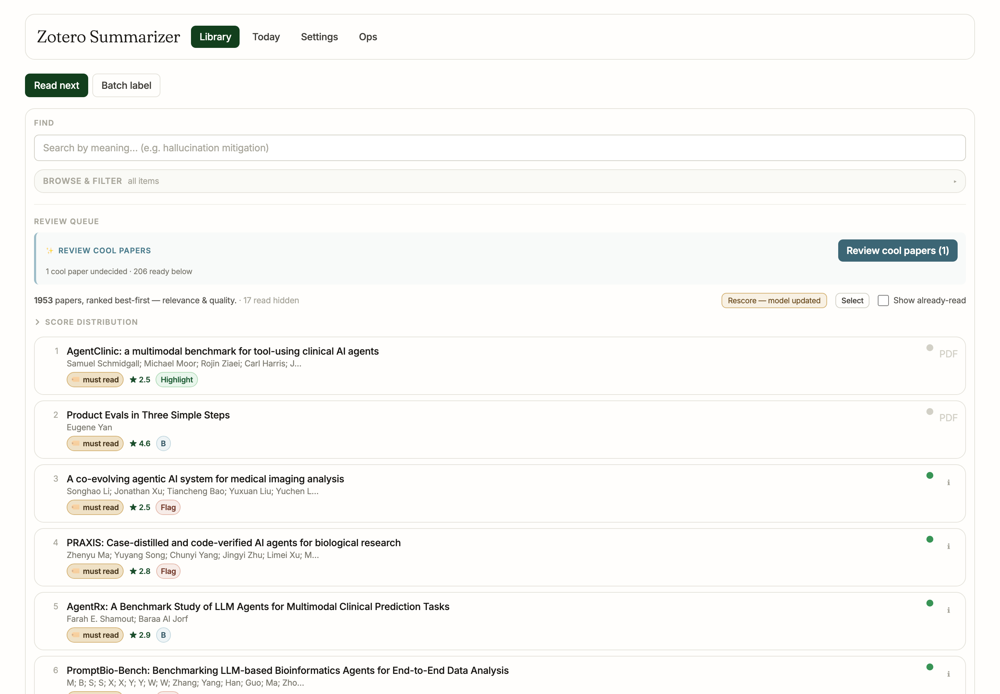
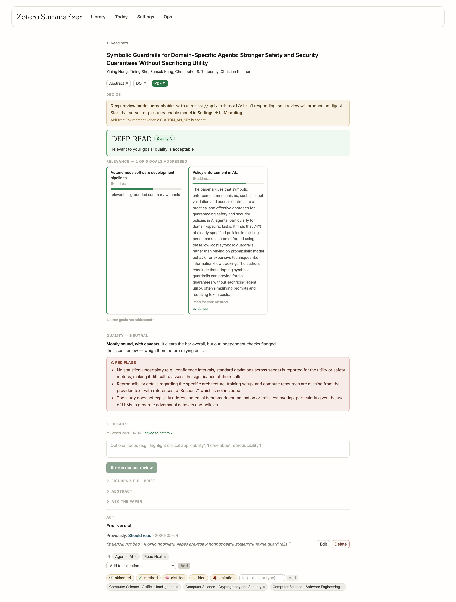
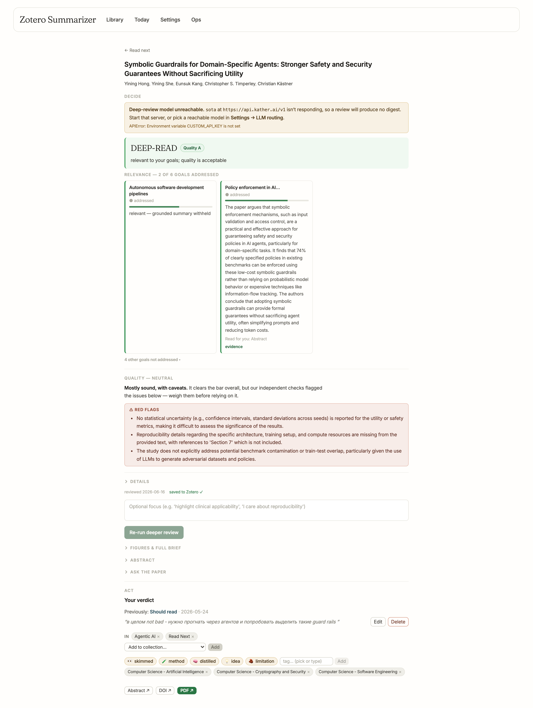
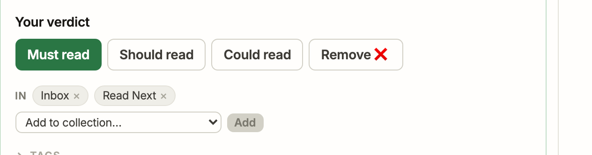
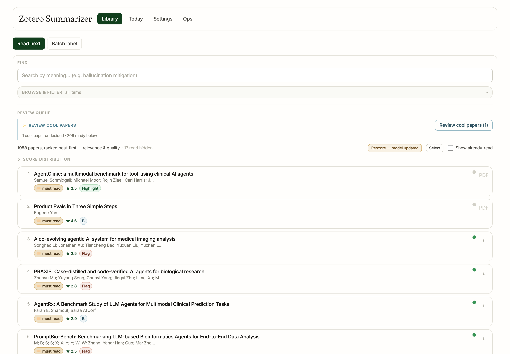
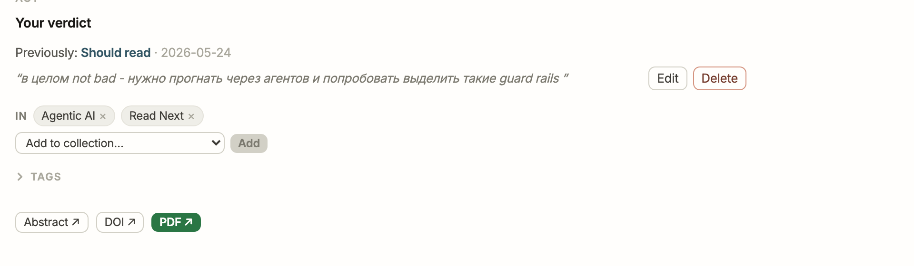

# Treatise — toward a generously simple triage UI

An iterative, screenshot-grounded simplification of the daily triage workflow.
Each iteration: subtract one source of visual noise, grounded in **≥4 design
skills**, verified against a fresh screenshot of the running app (real read-only
library), build + lint clean. Direction: **generously simple** — the page is the
ranked list and the decision, with everything else quiet or folded.

> Method: one persistent sandbox server (`ZS_OFFLINE=1`, no API creds → no
> Zotero writes); after each edit the built SPA (`frontend/dist`) is re-served and
> re-shot with patchright at 1440px + 390px. Screens in `treatise-screens/`.

The four recurring skill-lenses (each iteration also names any extra):
- **ponytail** — the ladder; subtract before add; does this element need to exist?
- **laws-of-ux-gate** — Hick's, Von Restorff, Serial Position, Miller, Jakob, Fitts.
- **kather-dataviz-gate** — message-first, one-code-one-meaning, subtract 20%, survive distance.
- **non-overfitting-fix** — the change is driven by state, not hardcoded to one case.

---

## Iteration 0 — baseline


Above the fold: nav · Read-next/Batch · FIND · BROWSE & FILTER · a REVIEW QUEUE
block (cool-papers + a paragraph + a 6-control meta-row: `scores as of … · model
updated, rescore for latest` `[Rescore]` `[Select]` `☐ Show already-read (🧠/👀)`)
· SCORE DISTRIBUTION · then the rows. **5 papers** reach the fold.

---

## Iteration 1 — collapse the score-status cluster


**Skills:** ponytail · laws-of-ux-gate · kather-dataviz-gate · non-overfitting-fix.

- ponytail → three score affordances for one job; the date is a value that never
  changes between rescans (→ button title).
- laws-of-ux (Hick/Von Restorff) → the only actionable signal is "model changed,
  rescore"; make the *button itself* the single accent.
- dataviz (subtract-20% / one-code) → the `scores as of {date}` text and the
  `(🧠/👀)` toggle legend are decoration, not message.
- non-overfitting → `scoresStale` drives the button's tone+label; no hardcoding.

**Change** (`ReadNextView.jsx`): `scores as of X · model updated, rescore for
latest [Rescore]` → one button that is amber **"Rescore — model updated"** when
stale, quiet **"Rescore"** when current (date → title). Dropped `(🧠/👀)` from the
Show-already-read label.

**Receipt:** 3 affordances + 1 legend → **1 stateful button**; fold gains a row
(5 → 6 papers above the fold). Build + eslint clean.

---

## Iteration 2 — trim the daily cool-papers prose


**Skills:** ponytail · laws-of-ux-gate (Paradox of the Active User) · kather-dataviz-gate (survive-distance) · scientific-critical-thinking.

The idle line was a 5-line instruction ("Deep-review the 1 undecided cool paper
(must/should-read) and propose a verdict for each — from each paper's full text.
206 already ready below."). Returning daily users don't re-read it; the
"what it does" already lives in the button's tooltip.

**Change** (`PredictionsBar.jsx`): keep the *state* (counts), cut the *instruction*
→ **"1 cool paper undecided · 206 ready below"**. (Kept the FIND/REVIEW/EXPORT
region labels — they're the deliberate Common-Region structure, not churn.)

**Receipt:** ~40 words → 6.

---

## Iteration 3 — row chip diet (drop the prestige pill)


**Skills:** ponytail · laws-of-ux-gate (Miller — ≤5 codes) · kather-dataviz-gate (one-code / subtract-20%) · non-overfitting-fix.

Each row carried 4 chip systems: 🏷 verdict · ★ score · **◆ top author/venue** ·
quality. The violet prestige pill was the wordiest label and a 4th colour — for a
signal the *best-first rank already encodes* (position IS the prestige-blended
order; true-geometry). Redundant per-row.

**Change** (`ReadNextView.jsx`): removed the `◆ top author/venue` chip (+ its now-dead
`isHighPrestige` import / `prestigeFloor` prop). Rows → **verdict · score · quality**.

**Receipt:** 4 chip systems → 3; one fewer colour. eslint clean (dead refs removed).

---

## Iteration 4 — one rose, not two (`/paper`)


**Skills:** ponytail · laws-of-ux-gate (Von Restorff) · kather-dataviz-gate (one-code-one-meaning) · scientific-critical-thinking.

Two full-width **rose** boxes competed: a "Deep-review model unreachable" *app-state
notice* and the paper's "⚠ Red flags" *finding*. Same colour, two meanings — a
system error read as loud as a quality problem.

**Change** (`DeepReviewSection.jsx`): the unreachable notice → **amber** (the
app-state tone used by its siblings). Rose is now reserved for the paper's own
red-flags — the single rose accent on the page.

---

## Iteration 5 — lead with the decision (`/paper`)
 

**Skills:** ponytail · laws-of-ux-gate (Serial Position) · kather-dataviz-gate (message-first) · senior-frontend (reuse the existing pattern).

The full page opened on a "DECIDE" eyebrow + a DOI/Abstract/PDF `LinksRow` —
low-salience navigation *above* the verdict banner. The compact card already
demotes those links to a muted bottom strip.

**Change** (`PaperDetailView/index.jsx`): drop the top `LinksRow`; render it at the
bottom for both surfaces. The page now opens on the **verdict banner** (the
decision), links last. (Left the verdict picker's "Remove ❌" — its ❌ is
intentional vocabulary tied to the Zotero ❌ tag, not decoration.)

---

## Iteration 6 — demote the cool-papers callout (gate-driven)


**Skills:** ponytail · laws-of-ux-gate (Von Restorff) · kather-dataviz-gate (survive-distance) · senior-code-reviewer (the gate).

An independent simplicity gate caught the inversion: a **filled** teal "Review
cool papers" button inside a **tinted bordered card** was the loudest object on
the page — gating an action for *1 paper* — while the 1953-row list rendered as
plain text below. Emphasis inverted relative to value.

**Change** (`PredictionsBar.jsx`): drop the tint + box; idle button → **ghost
(outline)**; keep a thin indigo rule for the tie to the cards it spawns. The amber
"Rescore — model updated" is now the page's single warm accent.

---

## Iteration 7 — fold the `/paper` tag strip (gate-driven)


**Skills:** ponytail · laws-of-ux-gate (Miller / Serial Position) · kather-dataviz-gate (subtract-20%) · senior-code-reviewer (the gate).

The next gate snagged on the one noisy region left: the `/paper` verdict zone
rendered tags **inline**, so a paper's 10+ subject-tag chips wrapped into a strip
right next to the decision (well past 7±2 equal-weight items).

**Change** (`PaperDetailView/index.jsx`): fold tags behind a **"Tags" disclosure**
on the full page too (the compact card already did). The Act zone is now verdict →
collection chips → folded Tags → muted links — identical, calm, on both surfaces.

---

## Result — PASS (generously simple)

Three independent gates: two found one issue each (over-loud callout; inline tag
strip), both fixed; the third returned **PASS** — *"the ranked list plus the
decision, a single warm accent doing the Von Restorff work, everything else
quieted or folded… without stripping the evidence, quality reasoning, tags, or
collection controls."*

```
        LIBRARY                 /paper                      CARD
  collapsed browse drawer   opens on the verdict      one-tap verdict
  ghost cool-papers + one   one rose (red-flags only) Read-Next default
   amber Rescore accent     addressed-goals-only board  folded tags
  3-chip rows (no prestige) folded tags · links last  verdict→coll→tags
```

**Seven build-clean, lint-clean, screenshot-verified subtractions; zero features
removed — only noise.** Each iteration grounded in ≥4 skills (ponytail ·
laws-of-ux-gate · kather-dataviz-gate · + non-overfitting / scientific-critical-
thinking / senior-frontend / the adversarial gate).
