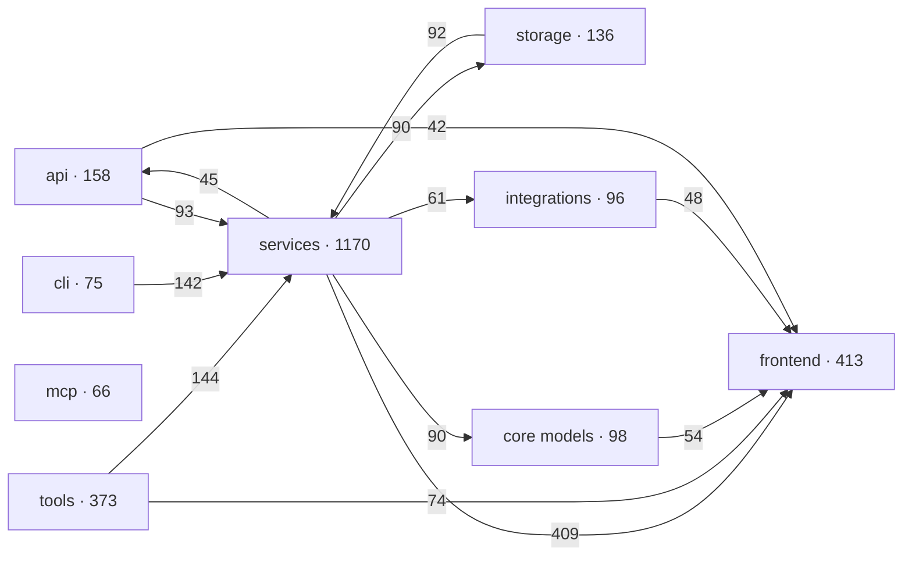
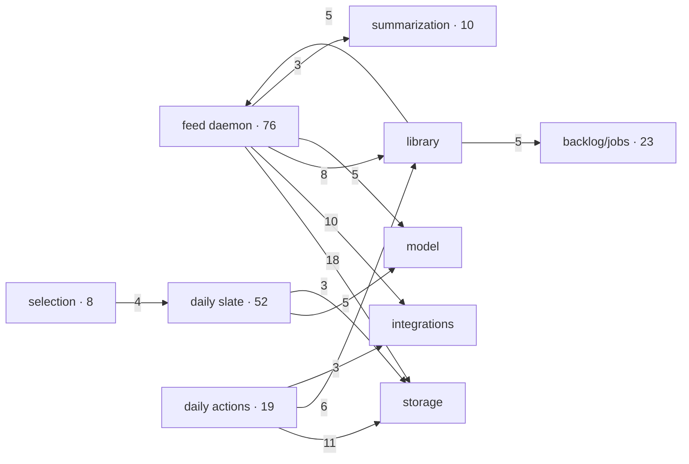

# RepoDoc architecture-diagnostics experiment

**Decision: reject RepoDoc 0.1.0 at upstream commit
`306becd0f143211c0dde2bdbd480578356280e28`.** Its parser can describe a
source-only snapshot, but its call graph, clustering, and incremental impact are
too noisy to be an architecture oracle. Do not add it to CI or the dependency
lock. Re-evaluate only after upstream honors ignore files, resolves symbols by
scope, fails closed on LLM errors, and bounds incremental fan-out.

The experiment used the current dirty worktree on 2026-08-27. Runtime artifacts
are under the gitignored `data/issue_runs/23/`; no generated documentation or
third-party code is committed.

## CAPA

| | Finding | Evidence / completion criterion |
|---|---|---|
| Symptom | A direct repository scan did not finish within three minutes and reached 1.49 GB RSS. | `/usr/bin/time -lp repodoc analyze ...`; stopped at 187.91 s. |
| Root cause | RepoDoc uses a fixed ignore list, does not read `.gitignore`, and does not exclude `node_modules`, `.agents`, or `.claude`. | Its file-tree pass selected 6,465 files under `frontend` and 2,238 under agent-config trees; the source-only counterfactual completed in 2.95 s / 94 MB. |
| Contributing cause | Global name matching invents call edges across languages and layers. | The nested frontend helper `get` received 600 incoming edges; the real import-policy check passed with zero violations. |
| Contributing cause | LLM clustering errors fall back to `batch_N` groups and the CLI still prints `Clustering done`. | Two deliberate 401 failures produced two arbitrary batches with exit status 0. |
| Containment | Keep RepoDoc outside the repository and use a source-only snapshot for this evaluation. | No dependency, hook, CI job, or generated canonical doc was added. |
| Corrective | Reject integration; retain the curated architecture page and existing import/dead-code gates. | `docs/architecture.md` remains the architecture source of truth. |
| Preventive | Any future candidate must pass the same full-tree, graph-precision, clustering-density, and one-file incremental tests. | Required: ignored trees excluded; zero false layer edges; 8–15 coherent groups; bounded update matching the changed component. |

Owner for containment/corrective action: repository maintainer. Upstream owns the
parser and clustering defects; a future evaluator owns the preventive rerun.

## Reproduction and cost

| Run | Result |
|---|---|
| Direct `repodoc analyze <repo>` | Timed out at 187.91 s; 1.49 GB maximum RSS; no graph written. |
| Source-only `repodoc analyze` | 2.95 s; 2,585 components, 4,539 edges, 246 leaf nodes; 94 MB maximum RSS. |
| `repodoc cluster` with invalid default credentials | Four 401 responses, then false-success fallback to two arbitrary batches. |
| `repodoc cluster` with configured GPT-OSS-120B | 240.07 s; 41 flat top-level groups, including duplicates such as `library_service` / `services_library`; no children. |
| Controlled `repodoc update --base-commit ... -y` | One class-docstring edit was reported as changes to all ten file components, expanded to 366 affected components and 13 regenerations, then produced no receipt or file before the five-minute watchdog stopped it. |

The successful clustering sent 6,696 prompt tokens. The serialized returned tree
contains 3,305 tokens, so the observable lower bound is 10,001 tokens. Exact
completion/reasoning usage is unavailable because the clustering path discards
the API `usage` object and writes no operation receipt.

## Thin graph projections

These views group RepoDoc's raw component edges by existing paths. They are
diagnostic projections, not the intended architecture. Edge labels are RepoDoc
call counts; only the strongest edges are shown.

### System projection

The backwards `storage → services`, `services → api`, and Python-to-frontend
edges contradict the source imports. They are graph false positives, not
architecture violations.

### Triage drill-down

The projection roughly exposes the real triage neighborhoods, but the reverse
library edges and inflated counts make it unsuitable for dependency decisions.

## Smell cross-check

- RepoDoc reports 211 graph isolates; the repository's independent Vulture scan
  reports seven 60%-confidence candidates and its consumer gate passes. Isolation
  therefore has very low precision as a dead-code signal here.
- RepoDoc reports two multi-node cycles (largest: five nodes). The largest mixes
  runtime settings with search-session path helpers and is driven by ambiguous
  names. The independent import-policy gate reports no layer cycle/violation.
- The highest fan-in node is an invented component for a nested JavaScript
  `get` helper (600 callers). This proves the apparent hubs are dominated by
  unscoped name resolution.
- The LLM tree has 41 top-level groups and no hierarchy, exceeding the issue's
  8–15-node readability gate and splitting identical domains across batch-local
  names.

## Go / no-go gates

| Gate | Result |
|---|---|
| Understandable in about 30 seconds | **Fail** — 41 flat groups; raw projection has false cross-layer edges. |
| Low enough visual density to expose smells | **Fail** — 4,539 edges, many from ambiguous names. |
| Correct against code and import policy | **Fail** — false Python/frontend and reverse-layer edges. |
| Useful non-obvious architecture question | **Fail** — apparent hubs/cycles do not survive independent checks. |
| Incremental update follows impact | **Fail** — one docstring edit expanded to 366 components and stalled. |
| Deterministic GitHub-friendly rendering | **Partial** — Mermaid renders, but meaningful grouping requires path-specific glue. |

The existing curated Mermaid views plus executable import, LOC, overlap, and
dead-code checks are smaller, deterministic, and more trustworthy for this
repository.
