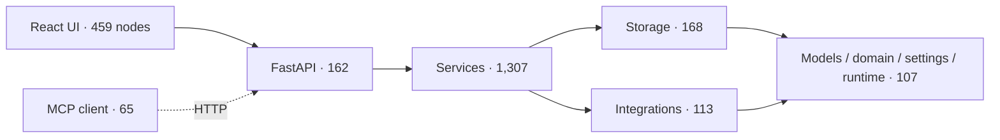
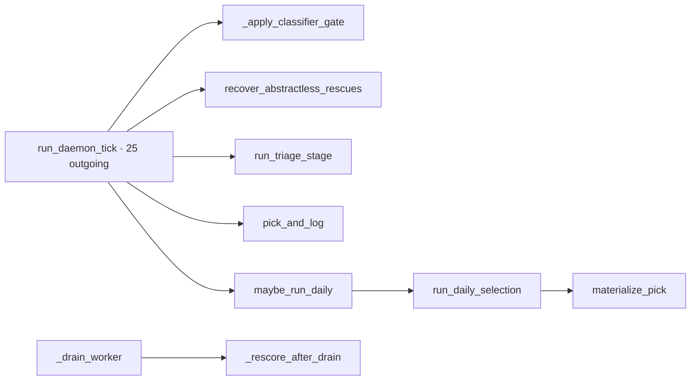

# RepoDoc experiment

**Date / revision:** 2026-09-24, `8f59dea` (`codex/sync-quality-issues`).
**RepoDoc:** `SYSUSELab/RepoDoc` shallow clone at `/tmp/zs-repodoc`; v0.1.0.
**Decision:** **Reject** RepoDoc as the living architecture layer for this repository.

## Run and cost

RepoDoc was installed in an isolated `/tmp` environment; no project dependency or
CI change was made. Its full-repository `analyze` ran for 2m17s, consumed about
900 MiB peak memory, and produced no artifact. A code-only copy containing
`zotero_summarizer/` and `frontend/src/` completed `analyze` in 1.7s:
2,458 components and 4,620 dependency edges. No LLM tokens were consumed by
analysis. `cluster` took 4.3s and made LLM requests with RepoDoc's invalid
default key; all retries returned HTTP 401. Token usage was therefore zero, and
RepoDoc fell back to two arbitrary batches (`batch_1`, `batch_2`), not semantic
modules. RepoDoc accepts an OpenAI-compatible `LLM_BASE_URL`, so I also tried
the running local Ollama endpoint with installed `qwen3.5:4b` and `qwen3:8b`.
Both reject chat completions with HTTP 400 (“does not support chat”); their
Ollama capabilities are completion-only. No model call succeeded and no tokens
were consumed. Generated files stayed under `/tmp`.

## System view

The node counts below are grouped from RepoDoc's code-only dependency graph by
directory. Relationships follow the repository's documented architecture
contract, since RepoDoc's inferred edges failed the correctness check below.

The counts show useful size, but this view is not generated architecture
documentation. The existing curated view in `docs/architecture.md` is clearer
and more accurate.

## Triage drill-down

The analyzed subgraph contained 192 components and 244 edges, split into 12 weak
components with 8 isolated nodes. RepoDoc identified `run_daemon_tick` as a hub
(25 outgoing edges), `make_candidate` as another high fan-out node (17), and
one cycle. The central orchestration neighborhood is:

This is only a rough code neighborhood; RepoDoc's cross-boundary links include
impossible edges (for example, `services → frontend` and `storage → services`).
Its graph therefore cannot be trusted to distinguish real layering violations
from name-resolution errors.

## Smells and incremental update

- **Cycles:** 63 in the whole code-only graph and one in the triage subgraph.
  These are candidates only; the tool does not validate whether its edges are
  correct.
- **Hubs:** `LibraryReadNext` (26 outgoing), `run_daemon_tick` (26), and
  `train_and_save` (23) were the top whole-graph nodes. The detected frontend
  links from backend/storage make these rankings unreliable.
- **Isolation:** eight isolated triage nodes are candidates, not proof of dead
  code. The graph also misses some expected calls, so Vulture/source review is
  needed before classifying them.
- **Layering:** observed reverse/invalid edges include storage→services,
  services→API, and services→frontend. These contradict the actual import
  policy and indicate graph extraction errors, not verified architecture bugs.
- **Incremental update:** not validated end to end. RepoDoc's `update` requires
  an initial knowledge graph/module tree produced by its generation pipeline;
  `analyze` and `cluster` alone do not produce the knowledge graph, and the
  generator/update path requires a chat-completions model. The default key
  returned 401, and the installed local Ollama models cannot serve chat
  completions. No claim of successful incremental artifact updates is made.
  A direct probe, `repodoc update . -o /tmp/zs-repodoc-output --base-commit
  HEAD --no-analyze-changes -y`, stopped immediately with “Knowledge graph not
  found”; no affected-module refresh could be observed.

RepoDoc did not surface a trustworthy non-obvious smell, did not form meaningful
modules with the default configuration, and could not demonstrate incremental
refresh. Retain the hand-curated Mermaid architecture views and existing
import-policy gate. Revisit only if RepoDoc can run with a chat-compatible model
and its emitted edges first pass the import-policy sanity check.
